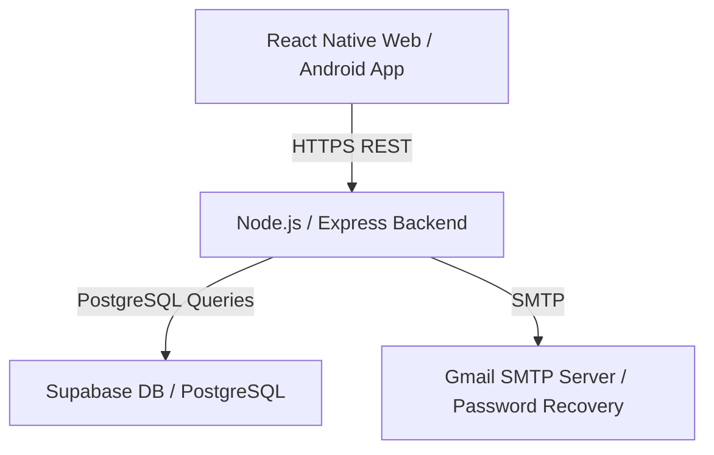

# Energy Saving Model

A full-stack application designed to help students, teachers, and individuals monitor, calculate, and optimize their daily appliance energy consumption. The project features a cross-platform React Native (Expo SDK 54) frontend, a Node.js/Express API backend, and a Supabase (PostgreSQL) database.

---

## 🚀 System Architecture



* **Frontend:** React Native, Expo SDK 54, React Navigation, Axios, Expo Secure Store, Expo Vector Icons.
* **Backend:** Node.js, Express, JWT (JsonWebToken) Auth, Nodemailer (password recovery email delivery).
* **Database:** Supabase (hosted PostgreSQL) + Local SQLite fallback capability.

---

## ✨ Key Features

1. **User Authentication:** Safe registration, login, and token-based sessions. Includes secure email-based **password reset** flows.
2. **Appliance Energy Calculator:** Add custom appliances (e.g. Fridge, Air Conditioner, LED lights) with power draw (Watts) and hours of use. Dynamically calculates:
   * **Daily Consumption (kWh)**
   * **Monthly Consumption (kWh)**
   * **Estimated Electricity Bill** (scaled based on utility rates)
3. **Energy Champions Leaderboard:** Ranks all registered platform users based on their energy savings percentage. Awards **Savings Badges** (e.g. *Eco Saver*, *Green Champion*).
4. **AI Chatbot Assistant:** A dedicated interactive helper offering direct tips and guidance on lowering electricity bills and reducing carbon footprints.
5. **Responsive Layouts:**
   * **Mobile App:** Clean, modern Tab & Stack navigation.
   * **Desktop Web App:** Custom responsive grid dashboard layout designed for classrooms and desktop monitors, with bottom navigation fully enabled.

---

## 📂 Project Directory Structure

```text
Energy_Saving_Model/
├── render.yaml                   # Render Blueprint for backend deployment
├── README.md                     # Project documentation (this file)
└── Energy_Saving/
    └── energy_saving/
        └── energy_saving/
            ├── supabase_setup.sql # Database schema & tables setup queries
            ├── run_locally.bat    # Script to run local dev servers concurrently
            ├── run_production.bat # Script to test production build locally
            ├── build_web.bat      # Script to bundle frontend for web hosting
            ├── build_android.bat  # Script to launch Expo EAS APK cloud compiler
            │
            ├── backend/           # Node.js Express API
            │   ├── index.js       # Main server entrypoint
            │   ├── package.json   # Backend dependencies & run scripts
            │   └── src/           # API routes, middlewares, & views
            │
            └── frontend/          # React Native + Expo App
                ├── App.js         # Navigation layout and Auth provider shell
                ├── app.json       # Expo configurations (EAS project ID, package name)
                ├── eas.json       # EAS build profiles (preview, production)
                ├── package.json   # Frontend dependency manifest (pruned of native conflicts)
                └── src/
                    ├── config.js  # Dynamic API server resolver (supports local IP auto-detect)
                    ├── context/   # React AuthContext state provider
                    ├── screens/   # Application screens (Home, Profile, Leaderboard, etc.)
                    └── components/# Reusable UI elements
```

---

## ⚙️ Environment Configuration

### Backend Environment (`backend/.env`)
Create a `.env` file in the `backend/` directory with the following variables:
```env
PORT=3000
SUPABASE_URL=your_supabase_project_url
SUPABASE_KEY=your_supabase_anon_public_key
EMAIL_USER=your_gmail_address
EMAIL_PASS=your_gmail_app_password
JWT_SECRET=your_custom_jwt_secret_token
```

### Frontend Environment
The frontend uses Expo environment variables. For EAS Cloud builds, these variables are pre-configured in `eas.json` under the `env` blocks.
For local compilation, you can configure:
* `EXPO_PUBLIC_API_URL`: Points to your backend (e.g., `https://energy-saving-backend.onrender.com` or `http://localhost:3000`).

---

## 💻 Running the Project Locally

We have provided convenient batch scripts to simplify running the project on Windows:

1. **Install Dependencies:**
   First, make sure both folders have their node packages:
   ```bash
   npm run install:all
   ```
2. **Run Local Dev Servers:**
   Double-click the **`run_locally.bat`** file in the project folder.
   * This starts the Express backend on `http://localhost:3000`.
   * It boots the Expo Metro dev server concurrently.
   * *Smart Feature:* The app automatically detects your host machine's local IP address, allowing physical mobile devices on the same Wi-Fi network to connect to your local backend server instantly.

---

## 🌐 Production Deployments

### A. Backend Deploy (Render)
The backend is set up for automatic deployment using a Blueprint on **Render**:
1. Create a free account on [Render](https://render.com).
2. Create a **New Blueprint** and link your Git repository.
3. Render will read the `render.yaml` file and deploy the Express API automatically.
4. Input your Supabase keys and Gmail credentials in the Render Environment Variables tab when prompted.

### B. Web App Deploy (Netlify / Vercel)
1. Double-click the **`build_web.bat`** script.
2. The script will bundle your app into static files inside `frontend/dist/`.
3. Drag and drop the `dist/` folder into [Netlify Drop](https://app.netlify.com/drop) or [Vercel](https://vercel.com) for instant, free hosting.
4. *Smart Feature:* The web app automatically resolves the API target to your live Render backend when built in production mode—no manual config required!

### C. Android APK Build (EAS Cloud)
1. Double-click the **`build_android.bat`** script.
2. Log in or create a free Expo account.
3. EAS Cloud Build will compile the standalone `.apk` installer and output a QR code.
4. Scan the QR code with your Android phone to install the application.

---

## 🛠️ Key Bugfixes & Improvements Made

* **Resolved Android Build Crashes:** Stripped out legacy libraries (`@react-native-community/voice`, `@react-native-community/masked-view`) that were pulling in conflicting old Android support resources, fixing `mergeReleaseResources` failures.
* **Auto-IP Resolution:** Replaced hardcoded IP configurations in `config.js` with dynamic Expo host URI detection and environment fallback.
* **Web Navigation Restored:** Enabled the bottom navigation tabs in desktop web layouts.
* **Layout Collapse Fixes:** Patched `flex: 1` styling inside `LeaderboardScreen.js` to prevent the ScrollView table from collapsing to height `0` on web browsers.
* **Robust Type Safety:** Guarded `.toFixed()` operations on leaderboard entries and summaries to prevent runtime exceptions on string or null values.
