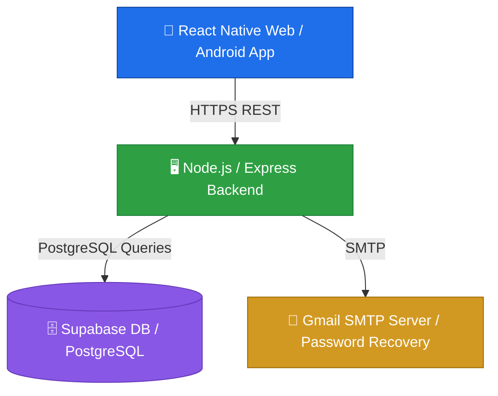

<div align="center">


<br/>

[](https://github.com/AmanMahadik)
[](https://creativecommons.org/licenses/by-nc/4.0/)
[](#-contributing)

<br/>

[](https://github.com/AmanMahadik/AmanMahadik)
[](https://github.com/AmanMahadik/AmanMahadik/commits)
[](https://github.com/AmanMahadik/AmanMahadik/stargazers)
[](https://github.com/AmanMahadik/AmanMahadik/network/members)
[](https://github.com/AmanMahadik/AmanMahadik/issues)

### ⚡ A full-stack energy companion that helps students, teachers, and everyday households **measure what they use — and save what they can.**

</div>

<br/>

<div align="center">

### 🛠️ Built With


<br/><br/>

**React Native (Expo SDK 54)** &nbsp;•&nbsp; **Node.js / Express** &nbsp;•&nbsp; **Supabase (PostgreSQL)** &nbsp;•&nbsp; **JWT Auth** &nbsp;•&nbsp; **Nodemailer**

</div>

<br/>

---

## 📲 Get the App

<div align="center">

### 👉 [**Download the Android Build (Expo)**](https://expo.dev/accounts/aman1611/projects/frontend/builds/533e6022-adbe-4258-b4bb-1a9cb3648c6e) 👈

Scan the QR on that page with **Expo Go**, or download the standalone `.apk` directly to your Android device.

</div>

---

## 📚 Table of Contents

- [About the Project](#-about-the-project)
- [Key Features](#-key-features)
- [System Architecture](#-system-architecture)
- [Project Structure](#-project-directory-structure)
- [Environment Setup](#%EF%B8%8F-environment-configuration)
- [Running Locally](#-running-the-project-locally)
- [Production Deployment](#-production-deployments)
- [Bugfixes & Improvements](#%EF%B8%8F-key-bugfixes--improvements-made)
- [Contributing](#-contributing)
- [License](#-license)
- [Author](#-author)

---

## 🌱 About the Project

**Energy Saving Model** is a full-stack application built to make energy literacy simple and visual. Whether you're a student learning about power consumption, a teacher running a classroom energy challenge, or just someone trying to shrink their next electricity bill — this app turns raw appliance data into clear numbers, friendly competition, and actionable advice.

> 💡 *Plug in your appliances. Watch your bill shrink. Climb the leaderboard.*

It ships as a single codebase that runs natively on **Android**, and as a **responsive web dashboard** for desktops and classroom displays — all powered by one shared backend.

---

## ✨ Key Features

<table>
<tr>
<td width="50%" valign="top">

### 🔐 User Authentication
Secure registration, login, and token-based sessions (JWT). Includes a complete email-based password recovery flow via Nodemailer.

### 🔌 Appliance Energy Calculator
Add custom appliances (Fridge, AC, LED lights, etc.) with power draw (Watts) and hours of use. Instantly calculates:
- ⚡ Daily Consumption (kWh)
- 📅 Monthly Consumption (kWh)
- 💰 Estimated Electricity Bill (scaled to utility rates)

</td>
<td width="50%" valign="top">

### 🏆 Energy Champions Leaderboard
Ranks every registered user by energy-savings percentage and awards **Savings Badges** like *Eco Saver* 🌿 and *Green Champion* 🏅.

### 🤖 AI Chatbot Assistant
A built-in conversational helper offering real-time tips on cutting electricity bills and shrinking your carbon footprint.

### 📱💻 Responsive on Every Screen
Clean Tab & Stack navigation on mobile, plus a custom desktop dashboard grid layout built for classrooms and wide monitors — bottom nav included.

</td>
</tr>
</table>

<div align="center">

```
🔋 ──────────────────────────────────────────── 🔋
   Less Watts Wasted   →   More Money Saved
🔋 ──────────────────────────────────────────── 🔋
```

</div>

---

## 🏗️ System Architecture

<div align="center">


<sub>📌 <i>Save the diagram to <code>docs/architecture-diagram.png</code> in your repo so this image renders — see note below.</i></sub>
</div>



| Layer | Technology |
|---|---|
| **Frontend** | React Native, Expo SDK 54, React Navigation, Axios, Expo Secure Store, Expo Vector Icons |
| **Backend** | Node.js, Express, JWT Auth, Nodemailer |
| **Database** | Supabase (hosted PostgreSQL) + Local SQLite fallback |

---

## 📂 Project Directory Structure

```text
Energy_Saving_Model/
├── render.yaml                   # Render Blueprint for backend deployment
├── README.md                     # Project documentation (this file)
└── Energy_Saving/
    └── energy_saving/
        └── energy_saving/
            ├── supabase_setup.sql # Database schema & tables setup queries
            ├── run_locally.bat    # Script to run local dev servers concurrently
            ├── run_production.bat # Script to test production build locally
            ├── build_web.bat      # Script to bundle frontend for web hosting
            ├── build_android.bat  # Script to launch Expo EAS APK cloud compiler
            │
            ├── backend/           # Node.js Express API
            │   ├── index.js       # Main server entrypoint
            │   ├── package.json   # Backend dependencies & run scripts
            │   └── src/           # API routes, middlewares, & views
            │
            └── frontend/          # React Native + Expo App
                ├── App.js         # Navigation layout and Auth provider shell
                ├── app.json       # Expo configurations (EAS project ID, package name)
                ├── eas.json       # EAS build profiles (preview, production)
                ├── package.json   # Frontend dependency manifest (pruned of native conflicts)
                └── src/
                    ├── config.js  # Dynamic API server resolver (supports local IP auto-detect)
                    ├── context/   # React AuthContext state provider
                    ├── screens/   # Application screens (Home, Profile, Leaderboard, etc.)
                    └── components/# Reusable UI elements
```

---

## ⚙️ Environment Configuration

<details>
<summary><b>🔧 Backend Environment (<code>backend/.env</code>)</b> — click to expand</summary>

<br/>

Create a `.env` file in the `backend/` directory with the following variables:

```env
PORT=3000
SUPABASE_URL=your_supabase_project_url
SUPABASE_KEY=your_supabase_anon_public_key
EMAIL_USER=your_gmail_address
EMAIL_PASS=your_gmail_app_password
JWT_SECRET=your_custom_jwt_secret_token
```

</details>

<details>
<summary><b>📱 Frontend Environment</b> — click to expand</summary>

<br/>

The frontend uses Expo environment variables.

- **EAS Cloud builds** — pre-configured under the `env` blocks in `eas.json`.
- **Local compilation** — configure:

```env
EXPO_PUBLIC_API_URL=https://energy-saving-backend.onrender.com
# or for local dev:
EXPO_PUBLIC_API_URL=http://localhost:3000
```

</details>

---

## 💻 Running the Project Locally

> Convenient batch scripts are included to simplify running the project on Windows.

**1️⃣ Install Dependencies**

```bash
npm run install:all
```

**2️⃣ Run Local Dev Servers**

Double-click `run_locally.bat` in the project folder. This will:

- 🚀 Start the Express backend on `http://localhost:3000`
- ⚛️ Boot the Expo Metro dev server concurrently

> **✨ Smart Feature:** The app automatically detects your host machine's local IP address, so physical mobile devices on the same Wi-Fi network can connect to your local backend instantly — zero manual config.

---

## 🌐 Production Deployments

### A. 🖥️ Backend Deploy — Render

1. Create a free account on [Render](https://render.com).
2. Create a **New Blueprint** and link your Git repository.
3. Render reads `render.yaml` and deploys the Express API automatically.
4. Add your Supabase keys and Gmail credentials in the Render **Environment Variables** tab when prompted.

### B. 🌍 Web App Deploy — Netlify / Vercel

1. Double-click `build_web.bat`.
2. The script bundles your app into static files inside `frontend/dist/`.
3. Drag and drop the `dist/` folder into [Netlify Drop](https://app.netlify.com/drop) or [Vercel](https://vercel.com) for instant, free hosting.

> **✨ Smart Feature:** The web app automatically resolves the API target to your live Render backend in production mode — no manual config required.

### C. 📱 Android APK Build — EAS Cloud

1. Double-click `build_android.bat`.
2. Log in or create a free Expo account.
3. EAS Cloud Build compiles the standalone `.apk` and outputs a QR code.
4. Scan the QR code with your Android phone to install.

> **Or skip straight to the prebuilt APK:** [📦 Download here](https://expo.dev/accounts/aman1611/projects/frontend/builds/533e6022-adbe-4258-b4bb-1a9cb3648c6e)

---

## 🛠️ Key Bugfixes & Improvements Made

- ✅ **Resolved Android Build Crashes** — stripped legacy libraries (`@react-native-community/voice`, `@react-native-community/masked-view`) that pulled in conflicting Android support resources, fixing `mergeReleaseResources` failures.
- ✅ **Auto-IP Resolution** — replaced hardcoded IPs in `config.js` with dynamic Expo host URI detection and environment fallback.
- ✅ **Web Navigation Restored** — re-enabled bottom navigation tabs in desktop web layouts.
- ✅ **Layout Collapse Fixes** — patched `flex: 1` styling inside `LeaderboardScreen.js` to stop the `ScrollView` table from collapsing to height `0` on web browsers.
- ✅ **Robust Type Safety** — guarded `.toFixed()` calls on leaderboard entries/summaries to prevent runtime exceptions on string or null values.

---

## 🤝 Contributing

This is an **open-source project** — contributions, forks, and pull requests are genuinely welcome! 🎉

```bash
# 1. Fork the repo
# 2. Clone your fork
git clone https://github.com/<your-username>/AmanMahadik.git

# 3. Create your feature branch
git checkout -b feature/amazing-feature

# 4. Commit your changes
git commit -m "Add some amazing feature"

# 5. Push to the branch
git push origin feature/amazing-feature

# 6. Open a Pull Request 🚀
```

Found a bug or have an idea? [Open an issue](../../issues) — every contribution helps make this project better for the next student or teacher who picks it up.

---

## 📄 License

<div align="center">

[](https://creativecommons.org/licenses/by-nc/4.0/)

</div>

This project is licensed under the **Creative Commons Attribution-NonCommercial 4.0 International License (CC BY-NC 4.0)**.

**You are free to:**
- ✅ **View & Share** — copy and redistribute the material in any medium or format
- ✅ **Adapt** — remix, transform, and build upon the material

**Under the following terms:**
- 📌 **Attribution** — you must give appropriate credit to **Aman Mahadik**, link to the license, and indicate if changes were made.
- 🚫 **NonCommercial** — you may **not** use the material for commercial purposes without explicit prior permission from the author.

Copyright © 2026 **Aman Mahadik**. All rights reserved beyond the terms above.
Full license text: [creativecommons.org/licenses/by-nc/4.0](https://creativecommons.org/licenses/by-nc/4.0/)

---

## 👤 Author

<div align="center">

**Aman Mahadik**

[](https://github.com/AmanMahadik)

<br/>

### ⭐ If this project helped you save energy (or just learn something), consider giving it a star!


</div>